<div align="center">



<a href="https://github.com/Chuongpham2004"></a>
<a href="mailto:hoangchuong869@gmail.com"></a>


</div>

```text
┌─[ chuongpham2004@dev ]─[ ~/identity ]
│
│  $ whoami --verbose
│  ▸ Pham Hoang Chuong (ChuongPham) — Java 21 Backend Engineer
│  ▸ Focus: microservices architecture · event-driven design · database optimization
│  ▸ Runtime: Java 21 Virtual Threads · Spring Boot 3.x · Spring Cloud
│  ▸ Pipelines: GitHub Actions · Jenkins · Docker · Kubernetes
│  ▸ Side quest: cross-platform mobile apps with Dart & Flutter
│
│  $ mission --current
│  ▸ Building a real-time ride-hailing & on-demand delivery platform on microservices —
│    Redis GEO driver matching, Kafka domain events, PostgreSQL as the source of truth.
│
│  $ ask-me-about
│  ▸ Java 21 · Spring Cloud · Kafka · Docker & Kubernetes
│
└─[ status: ONLINE ]──────────────────────────────────────────── [ ● ● ● ]
```


## `⌬` CORE SYSTEMS — TECHNICAL EXPERTISE

<table>
<tr><td width="180"><b><code>LANGUAGES</code></b></td><td>

  
</td></tr>
<tr><td><b><code>BACKEND</code></b></td><td>

   
</td></tr>
<tr><td><b><code>MOBILE</code></b></td><td>

 
</td></tr>
<tr><td><b><code>MESSAGING / CACHE</code></b></td><td>

  
</td></tr>
<tr><td><b><code>DATABASES</code></b></td><td>

  
</td></tr>
<tr><td><b><code>DEVOPS / CI-CD</code></b></td><td>

   
</td></tr>
<tr><td><b><code>ARCHITECTURE</code></b></td><td>

 -B45309?style=flat-square)    
</td></tr>
</table>


## `⌬` MISSION LOG — PROJECTS IN FLIGHT

### `[ ACTIVE ]` 🚗 Ride-Hailing & On-Demand Delivery Platform
`Analysis & design phase` · [Chuongpham2004/Ride-Hailing-Logistics](https://github.com/Chuongpham2004/Ride-Hailing-Logistics)

> A real-time platform connecting **customers** with **drivers** for two services — **RIDE** (passenger trips) and **DELIVERY** (on-demand parcels) — designed as a set of **Spring Boot microservices** from a full IEEE 830 SRS.
>
> **Tech:** `Java 21` `Spring Boot 3` `Spring Cloud Gateway` `Kafka` `Redis` `PostgreSQL` `GitHub Actions`

<details>
  <summary><strong>🧭 Architecture — 7 deployable services</strong></summary>
  <br>

  - Split into `api-gateway`, `realtime-gateway` (WebSocket), `user-service`, `location-service`, `trip-service`, `pricing-service` and `payment-service` — **one PostgreSQL database per service**.
  - **Kafka** is the only asynchronous integration channel between services; domain events use **JSON Schema (draft 2020-12)** contracts, published through a **transactional outbox**.
  - **Redis** holds only derived / short-lived data — driver **GEO index**, latest location with TTL, distributed locks, rate limits and quote cache — and can be rebuilt if lost.
  - Synchronous calls go through `RestClient` / OpenFeign with **Resilience4j** timeouts, bounded retries and circuit breakers.
</details>

<details>
  <summary><strong>⚡ Real-time dispatch & pricing</strong></summary>
  <br>

  - Drivers stream telemetry every **3–5 s** over WSS; `location-service` validates it and updates the Redis GEO index.
  - `trip-service` runs the **matching engine**, driver offers and the trip **state machine**, with optimistic locking and idempotency keys.
  - `pricing-service` computes quotes and **surge** from supply/demand counters bucketed by **Uber H3** cells.
  - `payment-service` keeps balances in a **ledger**, never in cache.
</details>

<details>
  <summary><strong>🛡️ CI/CD & quality gates</strong></summary>
  <br>

  - GitHub Actions workflows for **CI**, **delivery**, **PR quality** and **security scanning**.
  - Protected `main` / `develop` branches with required checks and code-scanning conversations.
  - Testing strategy: JUnit 5, Mockito, **Testcontainers** (Kafka, Redis, PostgreSQL) and Awaitility for concurrency tests.
</details>

<!--
### `[ ARCHIVE ]` 🏢 Company Name · *Your Role*
`Mon YYYY – Mon YYYY` · City, Country

> One-line summary of what you did there.

<details>
  <summary><strong>📦 Project name</strong> <em>(Mon YYYY – Mon YYYY)</em></summary>
  <br>

  - What you built, with a number if you have one.
  - **Tech Stack:** `Java` `Spring Boot`
</details>
-->


## `⌬` DEPLOYED ARTIFACTS — FEATURED PROJECTS

| Project | Description | Stack |
| :--- | :--- | :--- |
| **[Ride-Hailing-Logistics](https://github.com/Chuongpham2004/Ride-Hailing-Logistics)** | Real-time ride-hailing & on-demand delivery platform — microservices, Redis GEO driver matching, Kafka domain events, H3-based surge pricing and a ledger-backed wallet. | `Java 21` `Spring Boot` `Kafka` `Redis` `PostgreSQL` |
<!-- | **[next-project](https://github.com/Chuongpham2004/next-project)** | Short description. | `Flutter` `Dart` | -->

<!--


## `⌬` COMMENDATIONS — EDUCATION · CERTS · COMMUNITY

<table>
<tr><td width="50%" valign="top">

**🎓 Education**
- **Degree, Major** — University · YYYY – YYYY

**🏆 Honors & Awards**
- Award — *Organization* (YYYY)

</td><td width="50%" valign="top">

**📜 Certifications & Languages**


</td></tr>
</table>
-->


## `⌬` LIVE TELEMETRY — CONTRIBUTION SIGNAL

<div align="center">


<br><br>

<picture>
  <source media="(prefers-color-scheme: dark)" srcset="https://raw.githubusercontent.com/Chuongpham2004/Chuongpham2004/output/github-contribution-grid-snake-dark.svg" />
  <source media="(prefers-color-scheme: light)" srcset="https://raw.githubusercontent.com/Chuongpham2004/Chuongpham2004/output/github-contribution-grid-snake.svg" />
  
</picture>

</div>


<div align="center">

```text
[ TRANSMISSION END ] — Let's build scalable systems together.
```

<a href="https://github.com/Chuongpham2004"></a>&nbsp;<a href="mailto:hoangchuong869@gmail.com"></a>

</div>
